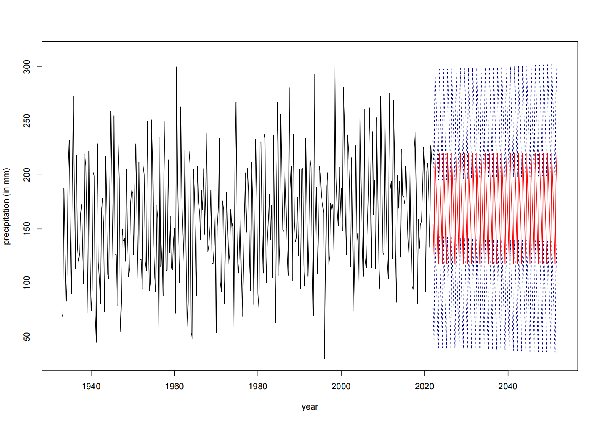

# Precipitation in Sweden (1933-2021)

This repository contains the analysis of precipitation trends in Sweden from 1933 to 2021, based on data provided by the [Swedish Meteorological and Hydrological Institute (SMHI)](https://www.smhi.se/). The goal of this project is to study the seasonal and overall trends in precipitation, model the time series, and forecast future precipitation measures.

---

## 📊 Data

- **Source:** SMHI, Sweden
- **Period:** 1933-2021 (seasonal data)
- **Stations:** Over 600 stations across Sweden
- **Seasons Defined By SMHI:**
  - Winter: December (previous year), January, February
  - Spring: March, April, May
  - Summer: June, July, August
  - Fall: September, October, November

> Note: Data before 1933 are considered less reliable and are not included.

---

## 🔍 Analysis Overview

We conducted a **time series analysis** to explore precipitation trends:

1. **General Precipitation Trends**
   - Seasonal time series (every 3 months)
   - Identified **seasonality of 4** (4 seasons per year)
   - Seasonal differencing applied
   - Stationarity confirmed using **ADF test**
   - Best SARIMA model found: `SARIMA(0,0,0)x(0,1,1)_4`

   
   
   **Forecast (2022-2051):**
   - Winter: 154 mm
   - Spring: 118 mm
   - Summer: 220 mm
   - Fall: 189 mm

   

2. **Seasonal Trends**
   - Winter & Spring: slight increasing trend observed
   - Summer & Fall: stationary, no clear trend
   - Contribution to overall trend:
     - Winter drives slight increase
     - Spring supports minor growth
     - Summer and Fall maintain stability

   

---

## 📈 Seasonal ADF Tests

- **Winter & Spring:** Slight increase, but series considered stationary (p < 0.05)
- **Summer & Fall:** Stationary as expected

---

## ⚡ Key Findings

- Precipitation in Sweden is highly **season-dependent**, with higher amounts in summer and fall.
- **Overall precipitation trend (1933-2021) shows a slight increase**, consistent with global patterns but relatively mild.
- **Winter precipitation drives the minor increase**, spring supports it slightly; summer and fall remain stable.
- Unlike some European studies, **summer precipitation in Sweden did not increase significantly**.
- Forecasts are largely **season-dependent**, with similar patterns expected in future decades.

---

## 🛠 Methodology

- Seasonal time series analysis
- Stationarity check using **ADF test**
- Seasonal differencing
- **SARIMA modeling** for trend and forecasting
- Residual diagnostics (histogram, QQ-plot, Ljung-Box test)

---

**Authors:** Jie & Tom 
